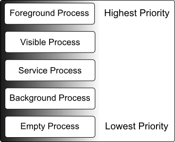

В предыдущих главах мы узнали, что Android-приложения выполняются внутри процессов и что они состоят из нескольких компонентов в виде активностей, сервисов и Broadcast-приемников. Цель этой главы - расширить эти знания, рассмотрев жизненный цикл приложений и активностей в системе Android. 

Несмотря на фанфары о том, сколько памяти и вычислительной мощности находится в современных мобильных устройствах по сравнению с настольными системами вчерашнего дня, важно помнить, что эти устройства по-прежнему считаются ограниченными ресурсами, по стандартам современных систем на базе настольных и портативных компьютеров, особенно с точки зрения памяти. Таким образом, основная задача системы Android обеспечить эффективное управление этими ограниченными ресурсами и быстрое реагирование на действия пользователя, как операционной системы, так и приложений работающих на ней. Для достижения этой цели Android предоставляется полный контроль над жизненным циклом и состоянием как процессов, в которых работают приложения, так и отдельных компонентов, составляющих эти приложения. Таким образом, важным фактором при разработке приложений Android является понимание моделей управления жизненным циклом приложений и активностей в Android, а также способов, которыми приложение может реагировать на изменения состояний, которые могут происходить во время его работы.

## Приложения и управление ресурсами
Каждое запущенное приложение Android рассматривается операционной системой как отдельный процесс. Если система определяет, что ресурсы на устройстве достигают своей емкости, она предпримет шаги для завершения процессов, чтобы освободить память. 

Для определения того, какой процесс завершить, чтобы освободить память, система принимает во внимание как приоритет, так и состояние всех запущенных в данный момент процессов, комбинируя эти факторы для создания того, что Google называет *importance hierarchy* (иерархией важности). Затем процессы завершаются, начиная с самого неважного и работая по иерархии до тех пор, пока не будет высвобождено достаточно ресурсов для функционирования системы.

## Состояние процессов
Приложения состоят из компонентов. В системе Android текущее состояние процесса определяется активным компонентом самого высокого ранга в приложении, которое он размещает. Как показано на рис. 12-1, процесс в любой момент времени может находиться в одном из следующих пяти состояний:



### Foreground Process
Этим процессам назначается высший уровень приоритета. Маловероятно, что в любой момент времени будет активным более одного или двух процессов foreground, и они обычно заканчиваются системой последними. Процесс должен соответствовать одному или нескольким из следующих критериев, чтобы претендовать на статус foreground: 

- Содержит активность, с которой пользователь в данный момент взаимодействует. 
- Содержит сервис, связанный с активностью, с которой взаимодействует пользователь. 
- Содержит сервис, который с помощью вызова ```startForeground()``` сообщил, что завершение работы может нарушить работу пользователя. 
- Содержит сервис, выполняющий обратные вызовы ```onCreate()```, ```onResume()``` или ```onStart()```. 
- Содержит Broadcast-приемник, который в настоящее время выполняет свой метод ```onReceive()```.

### Visible Process
Процесс, содержащий активрость, видимую пользователю, но не являющуюся той, с которой он взаимодействует. Обычно это происходит, когда активность в процессе видна пользователю, но другая активность, такая как частичный экран или диалог, находится на переднем плане. Процесс также имеет право на статус visible, если он размещает сервис, который связан с видимой или активной активностью.

### Service Process
Процессы, содержащие cервис, который уже был запущен и в настоящее время выполняется.

### Background Process
Процесс, который содержит одну или несколько активностей, которые в настоящее время не видны пользователю, и не размещают сервисов, которые соответствуют статусу *Service Process*. Процессы, попадающие в эту категорию, подвергаются высокому риску завершения в случае необходимости освобождения дополнительной памяти для процессов с более высоким приоритетом. Android поддерживает динамический список фоновых процессов, завершая процессы в хронологическом порядке, первыми уничтожаются более старые.

### Empty Process
Пустые процессы больше не содержат активных приложений и хранятся в памяти, готовые служить хостами для вновь запускаемых приложений. Это в некоторой степени аналогично тому, как в автобусе держать двери открытыми c запущенным двигателем в ожидании прибытия пассажиров. Очевидно, что такие процессы имеют самый низкий приоритет и должны быть остановлены в первую очередь для освобождения ресурсов.

## Межпроцессорные зависимости
Ситуация с определением процесса с наивысшим приоритетом немного сложнее, чем описано в предыдущем разделе, по причине, что процессы часто могут быть взаимозависимыми. Таким образом, при определении приоритета процесса система Android также будет учитывать, обслуживает ли процесс каким-либо образом другой процесс с более высоким приоритетом (например, процесс сервиса, действующий в качестве поставщика контента для foreground-процесса). Как правило, документация Android гласит, что процесс никогда не может быть оценен ниже, чем другой процесс, который он в настоящее время обслуживает.

## Жизненый цикл активности
Как мы определили ранее, состояние процесса Android в значительной степени определяется статусом активности и компонентов, которое она размещает. Поэтому важно понимать, что эти активности также переходят через разные состояния в течение времени выполнения приложения. Текущее состояние активности частично определяется ее положением в *Activity Stack* (стек активностей).

## Cтек активностей
Для каждого приложения, работающего на устройстве Android, система поддерживает стек активностей. Когда приложение запускается, первое из запускаемых активностей приложения помещается в стек. Когда запускается вторая активность, она помещается в верхнюю часть стека, а предыдущая перемещается вниз. Активность в верхней части стека называется активной (или выполняющейся) активностью. Когда активная активность завершается, она выталкивается из стека средой выполнения, и активность, расположенная в стеке непосредственно под ней, становится текущей активной активностью. Активность в верхней части стека, могла просто завершиться, потому что задача, за которую она отвечает была выполнена. Или пользователь мог нажать кнопку *Back* на экране, чтобы вернуться к предыдущей активности, в результате чего текущая активность будет извлечена из стека системой и, следовательно, уничтожена. Визуальное представление стека ативностей Android показано на рисунке 12-2.


Как показано на схеме, при запуске новые активности помещаются в верхнюю часть стека. Текущая активная активность находится на верху стека до тех пор, пока она либо не будет вытолкнута ниже новой активностью, либо не будет извлечена из стека при ее завершении. В случае, если ресурсы становятся ограниченными, среда выполнения завершает активности, начиная с тех, что находятся в нижней части стека.

Стек активностей - это то, что в терминологии программирования называется стеком *последним вошел - первым ушел* (LIFO). Последний элемент, помещаемый в стек, извлекается первым.

## Состояния активностей
Активность в приложении может находиться в одном из нескольких состояний во время выполнения:
- **Active/Running** (активный/выполняется) - действие находится в верхней части стека активностей, является foreground-задачей, видимой на экране устройства, имеет фокус и в настоящее время взаимодействует с пользователем. Наименее вероятно, что эта активность будет прекращена в случае нехватки ресурсов. 
- **Paused** (приостановлено) - активность отображается для пользователя, но в данный момент не имеет фокуса (обычно потому, что эта активность частично скрыта текущей активной активностью). Приостановленные активности хранятся в памяти, остаются привязанными к оконному менеджеру, сохраняют всю информацию о состоянии и могут быть быстро восстановлены до активного состояния при перемещении в верхнюю часть стека активностей.
- **Stoped** (остановлено) - активность не отображается для пользователя (другими словами, она полностью скрыта на дисплее устройства другими активностями). Как и в случае приостановленных активностей, она сохраняет всю информацию о состоянии, но имеет более высокий риск завершения в ситуациях с нехваткой памяти. 
- **Killed** (прервано) - активность была прекращена системой Android для освобождения памяти и больше не присутствует в стеке активностей. Такие активности будет необходимо перезапустить, если этого потребует приложение.

## Изменение конфигурации
До сих пор в этой главе мы рассматривали две причины изменения состояния активности Android, а именно перемещение активности между передним планом и фоном и прекращение активности системой, чтобы освободить объем памяти.Существует третий сценарий, в котором состояние активности может резко измениться, и это изменение конфигурации устройства. 

По умолчанию любое изменение конфигурации, которое влияет на внешний вид активности (например, изменение ориентации устройства с книжной на альбомную или изменение настроек системного шрифта), приведет к уничтожению и воссозданию активности. Причина в том, что такие изменения влияют на такие ресурсы, как макет пользовательского интерфейса и простое уничтожение и воссоздание затронутых активностей - это самый быстрый и надежный способ для реагировая на изменение конфигурации. Однако можно настроить активность так, чтобы она не перезапускалась системой в ответ на определенные изменения конфигурации.

## Обработка изменения состояния
По крайней мере, из этой главы должно быть ясно, что приложение и содержащиеся в нем компоненты будут переходить через множество состояний в течение своего жизненного цикла. Особое значение имеет тот факт, что эти изменения состояния (вплоть до полного завершения) накладываются на приложение средой выполнения Android в зависимости от действий пользователя и доступности ресурсов на устройстве.

Однако, на практике эти изменения состояния не навязываются без уведомления, и в большинстве случаев приложение будет извещено системой об изменениях и получит возможность отреагировать соответствующим образом. Обычно включает в себя сохранение или восстановление как внутренних структур данных, так и состояния пользовательского интерфейса, тем самым позволяя пользователю беспрепятственно переключаться между приложениями и обеспечивая, по крайней мере, появление нескольких одновременно работающих приложений. 

Android предоставляет два способа обработки изменений состояний жизненного цикла объектов в приложении. Один из подходов включает ответ на вызовы методов изменения состояния из операционной системы и подробно рассматривается в следующей главе.

Новый подход, рекомендованный Google, использует классы жизненного цикла, включенные в компоненты *Android Jetpack Architecture*. Об этом будет более подробно рассказано далее. Сильно далее :)

## Резюме
Обычно считается, что мобильные устройства имеют ограниченные ресурсы, особенно с точки зрения объема встроенной памяти. Следовательно, основная ответственность операционной системы Android заключается в обеспечении того, чтобы приложения и операционная система в целом оставались отзывчивыми для пользователя. Приложения размещаются на Android внутри процессов. Каждое приложение, в свою очередь, состоит из компонентов в виде активностей и сервисов. 

Система Android может завершать как процессы, так и отдельные активности, чтобы освободить память. Состояние процесса принимается во внимание исполняющей системой при принятии решения о том, является ли процесс подходящим кандидатом для завершения. Состояние процесса во многом зависит от статуса активностей, исполняющихся в рамках этого процесса. 

Ключевой посыл этой главы заключается в том, что приложение проходит через множество состояний в течение своего времени выполнения и практически не контролирует свою судьбу в среде Android. Те процессы и активности, которые напрямую не взаимодействуют с пользователем, подвергаются более высокому риску завершения системой. Таким образом, важным элементом разработки приложений Android является способность приложения реагировать на уведомления от операционной системы об изменении состояния.
