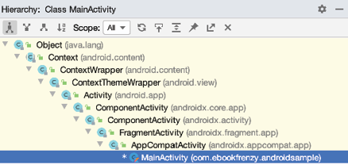
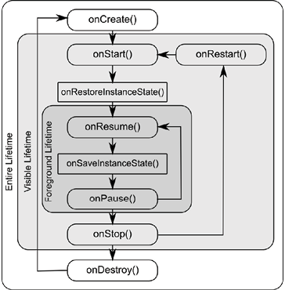

Основываясь на информации, изложенной в предыдущей главе, теперь нам известно, что активности и фрагменты, составляющие приложение, проходят через множество различных состояний. Переход из одного состояния в другое осуществляется системой Android и, следовательно, в значительной степени находится вне контроля самой активности. Однако это не означает, что приложение не может реагировать на эти изменения и предпринимать соответствующие действия. Основная цель этой главы - предоставить общий обзор способов, с помощью которых активность может быть уведомлена об изменении состояния, и выяснить места, в которых желательно сохранять или восстанавливать информацию о состоянии.

## Новые и старые методы
До недавнего времени существовал стандартный способ встроить в приложение получение информации о жизненном цикле. Это подход описан в этой главе, и включает реализацию набора методов (по одному для каждого состояния жизненного цикла) в экземпляре активности или фрагмента, которые вызываются операционной системой при изменении состояния жизненного цикла этого объекта. Этот подход оставался неизменным с первых лет существования операционной системы Android и, хотя он все еще является жизнеспособным вариантом и сегодня, имеет некоторые ограничения, которые будут объяснены позже в этой главе.

С представления классов жизненного цикла из *Jetpack Android Architecture Components*, теперь доступен лучший подход к управлению жизненным циклом. Этот современный подход (вместе с компонентами Jetpack и рекомендациями по архитектуре) будет подробно рассмотрен в следующих главах. Тем не менее, по-прежнему важно понимать традиционные методы жизненного цикла по нескольким причинам. Во-первых, как разработчик Android вы не будете полностью изолированы от традиционных методов жизненного цикла и по-прежнему будете использовать некоторые из них. Во-вторых, понимание старого способа управления жизненными циклами обеспечит хорошую основу для изучения нового подхода позже в этой книге.

## Классы Activity и Fragment
За некоторыми исключениями, активности и фрагменты в приложении создаются как подклассы классов AppCompatActivity и Fragment соответственно. Рассмотрим, например, простой проект *AndroidSample* (конвертор валют), созданный ранее. Загрузите этот проект в Android Studio и откройте файл *MainActivity.java*. Файл должен выглядеть примерно следующим образом:
```java
import androidx.appcompat.app.AppCompatActivity; 
import android.os.Bundle; 
import android.view.View; 

public class MainActivity extends AppCompatActivity { 

  @Override 
  protected void onCreate(Bundle savedInstanceState) { 
    super.onCreate(savedInstanceState); 
    setContentView(R.layout.activity_main); 
  } 
  
  public void convertCurrency(View view) { 
    EditText dollarText = findViewById(R.id.dollarText); 
    TextView textView = findViewById(R.id.textView); 
    
    if (!dollarText.getText().toString().equals("")) { 
      Float dollarValue = Float.valueOf(dollarText.getText().toString()); 
      Float euroValue = dollarValue * 0.85F; 
      textView.setText(euroValue.toString()); 
    } else { 
      textView.setText(R.string.no_value_string); 
    } 
  } 
} 
```
При создании проекта мы проинструктировали Android Studio также создать начальную активность с именем *MainActivity*. Как видно из приведенного выше кода, класс MainActivity является подклассом класса AppCompatActivity.

Обзор справочной документации для класса AppCompatActivity покажет, что он сам является подклассом класса Activity. Это можно проверить в редакторе Android Studio с помощью окна *Hierarchy*. В файле MainActivity.java, щелкните на ```AppCompatActivity``` в строке объявления класса и нажмите сочетание клавиш ```Ctrl-H```. Появится окно инструмента *Hierarchy*, отображающее иерархию классов для выбранного класса. Как показано на рис. 13-1, *AppCompatActivity* явно является подклассом класса *FragmentActivity*, который в конечном итоге является подклассом класса *Activity*:



Классы *Activity* и *Fragment* содержат ряд методов, которые предназначены для вызова средой выполнения Android для уведомления объекта об изменении его состояния. Мы будем называть их методами жизненного цикла. Класс активности или фрагмента просто должен переопределить эти методы и реализовать в них необходимые функции, чтобы соответствующим образом реагировать на изменения состояния. Один из таких методов называется ```onCreate()```, и, снова обращаясь к приведенному выше фрагменту кода, мы видим, что этот метод уже был переопределен и реализован для нас в классе *MainActivity*. В следующем разделе мы подробно рассмотрим как ```onCreate()```, так и другие соответствующие методы жизненного цикла классов *Activity* и *Fragment*.

## Динамическое и постоянное состояния
Ключевая цель управления жизненным циклом - обеспечение сохранения и восстановления состояния активности в нужное время. Говоря о состоянии в текущем контексте, мы имеем в виду данные, которые в данный момент хранятся в активности, и внешний вид пользовательского интерфейса. Например, активность может поддерживать модель данных в памяти, которую необходимо сохранить в базе данных, контект провайдере или файле. Такая информация о состоянии, поскольку она сохраняется от одного вызова приложения к другому, называется постоянным состоянием.

Внешний вид пользовательского интерфейса (например, текст, введенный в текстовом поле, но еще не зафиксированный во внутренней модели данных приложения) называется динамическим состоянием, поскольку оно сохраняется только в текущее время выполнения приложения (а также называется состоянием пользовательского интерфейса или состоянием экземпляра).

Понимание различий между этими двумя состояниями важно, потому что и способы их сохранения, и причины для этого различаются.

Цель сохранения постоянного состояния - избежать потери данных, которая может возникнуть в результате прекращения неактивной активности системой. С другой стороны, динамическое состояние сохраняется и восстанавливается по несколько более сложным причинам.

Например, приложение содержит активность ```A```, содержащую текстовое поле и несколько переключателей. В процессе использования приложения пользователь вводит текст в текстовое поле и делает выбор с помощью переключателей. Однако перед выполнением действия по сохранению этих изменений пользователь переключается на другую активность, в результате чего активность ```A``` перемещается в стекe активностей и помещается в фоновый режим. Через некоторое время система определяет, что памяти мало и прекращает активность ```A```, чтобы освободить ресурсы. Однако, что касается пользователя, активность A была просто помещена в фоновый режим и готова к перемещению на передний план в любое время. При возврате активности ```A``` на передний план пользователь вполне разумно ожидал бы, что введенный текст и выбранные переключатели будут сохранены. Однако в этом сценарии будет создан новый экземпляр активности ```A```, и если динамическое состояние не было сохранено и восстановлено, предыдущий пользовательский ввод будет потерян.

Таким образом, основная цель сохранения динамического состояния состоит в том, чтобы создать ощущение плавного переключения между активными активностями и фоновыми, независимо от того, что активности действительно могли быть прерваны и перезапущены без ведома пользователя. 

Механизмы сохранения постоянного и динамического состояния станут более понятными в следующих разделах этой главы.

## Методы жизненого цикла
Как объяснялось ранее, классы *Activity* и *Fragment* содержат ряд методов жизненного цикла, которые действуют как обработчики событий при изменении состояния экземпляра. Основные методы, поддерживаемые классами *Activity* и *Fragment*, следующие:

- ```onCreate(Bundle savedInstanceState)``` - метод, вызываемый при первом создании активности, и идеальное место для выполнения большинства задач инициализации. Этому методу передается аргумент в виде объекта типа *Bundle*, который может содержать информацию о динамическом состоянии (обычно относящуюся к состоянию пользовательского интерфейса) от предыдущего вызова активности. 
- ```onRestart()``` - вызывается, когда активность собирается перезапуститься после того, как она было ранее остановлена системой выполнения. 
- ```onStart()``` - всегда вызывается сразу после вызова методов ```onCreate()``` или ```onRestart()```, этот метод указывает активности, что она собирается стать видимой для пользователя. Этот вызов будет сопровождаться вызовом ```onResume()```, если активность перемещается на вершину стека активностей, или ```onStop()``` в случае, если оно выталкивается вниз по стеку другой активностью. 
- ```onResume()``` - указывает, что действие теперь находится на вершине стека активностей и является активностью, с которой в данный момент взаимодействует пользователь.
- ```onPause()``` - указывает, что предыдущая активность скоро станет активностью на переднем плане. За этим вызовом последует вызов метода ```onResume()``` или ```onStop()``` в зависимости от того, перемещается ли активность обратно на передний план или становится невидимой для пользователя. В этом методе могут быть предприняты шаги для сохранения постоянной информации о состоянии, еще не сохраненной приложением. Чтобы избежать задержек при переключении между активностями, следует избегать трудоемких операций в этом методе, таких как сохранение данных в базе данных или выполнение сетевых операций. Этот метод также должен гарантировать, что любые задачи, интенсивно использующие процессор, такие как анимация, будут остановлены. 
- ```onStop()``` - активность больше не отображается для пользователя. Возможно два сценария, которые могут последовать за этим вызовом, - это вызов ```onRestart()``` в случае, если активность снова перемещается на передний план, или ```onDestroy()```, если активность завершается. 
- ```onDestroy()``` - активность вот-вот будет уничтожена, либо добровольно, потому что активность выполнила свои задачи и вызвала метод ```finish()```, либо потому, что среда выполнения завершает его либо для освобождения памяти, либо из-за изменения конфигурации (например, ориентация устройства меняется). Важно отметить, что вызов ```onDestroy()``` не всегда будет выполняться после завершения активности.
- ```onConfigurationChanged()``` - вызывается, когда происходит изменение конфигурации, для которого активность указывала, что перезапуск не требуется. В метод передается объект типа *Configuration*, в котором описывается новая конфигурация устройства, после чего активность должна реагировать на изменение. Следующие методы жизненного цикла применяются только к классу *Fragment*: 
- ```onAttach()``` - вызывается, когда фрагмент назначается активности. 
- ```onCreateView()``` - вызывается для создания и возврата фрагмента макета пользовательского интерфейса. 
- ```onActivityCreated()``` - метод ```onCreate()``` активности, с которым связан фрагмент, завершил выполнение. 
- ```onViewStatusRestored()``` - фрагмент сохраненного представления был восстановлен. 

В дополнение к методам жизненного цикла, описанным выше, существует два метода, специально предназначенных для сохранения и восстановления динамического состояния активности: 
- ```onRestoreInstanceState(Bundle savedInstanceState)``` - этот метод вызывается сразу после вызова метода ```onStart()``` при событии, что активность перезапускается с предыдущего вызова, в котором было сохранено состояние. Как и в случае с ```onCreate()```, этому методу передается объект типа *Bundle*, содержащий данные предыдущего состояния. Этот метод обычно используется в ситуациях, когда он делает что-нибудь при восстановлении предыдущего состояния, после того, как инициализация активности была выполнена в ```onCreate()``` и ```onStart()```.
- ```onSaveInstanceState(Bundle outState)``` - вызывается перед уничтожением активности, чтобы можно было сохранить текущее динамическое состояние (обычно относящееся к пользовательскому интерфейсу). Этому методу передается объект *Bundle*, в котором должно быть сохранено состояние и который впоследствии передается в методы ```onCreate()``` и ```onRestoreInstanceState()``` при перезапуске активности. Обратите внимание, что этот метод вызывается только в ситуациях, когда среда выполнения определяет, что динамическое состояние необходимо сохранить.

При переопределении вышеуказанных методов важно помнить, что, за исключением ```onRestoreInstanceState()``` и ```onSaveInstanceState()```, реализация метода должна включать вызов соответствующего метода в суперклассе. Например, следующий метод переопределяет метод ```onRestart()```, но также включает вызов метода экземпляра суперкласса: 
```java
protected void onRestart () {
  super.onRestart (); 
  Log.i (TAG, «onRestart»); 
}
```
Невыполнение вызова метода суперкласса в переопределениях приведет к тому, что среда выполнения выдаст исключение во время исполнения. 

Вызовы методов суперкласса в ```onRestoreInstanceState()``` и ```onSaveInstanceState()``` пусть и не являются обязательными, их использование дает значительные преимущества, и этот вопрос будет рассмотрен далее в книге.

## Lifetime (время жизни)
Последняя тема, включает в себя схему *entire*, *visible* и *foreground* времени жизни, через которое активность или фрагмент будут переходить во время выполнения:
- **Entire Lifetime** - этот термин используется для описания всего, что происходит между первоначальным вызовом метода ```onCreate()``` и вызовом метода ```onDestroy()``` до уничтожения объекта. 
- **Visible Lifetime** - охватывает периоды выполнения между вызовом ```onStart()``` и ```onStop()```. В течение этого периода активность или фрагмент видны пользователю, хотя могут не быть тем объектом, с которым пользователь в настоящее время взаимодействует. 
- **Foreground Lifetime** - относится к периодам выполнения между вызовами методов ```onResume()``` и ```onPause()```. 

Важно отметить, что активность или фрагмент могут проходить через периоды жизни *foreground* и *visible* несколько раз в течение периода *entire*. Концепции продолжительности жизни и методы жизненного цикла показаны на рисунке 13-2:



## Складные устройства
Как обсуждалось ранее, активность считается возобновленной, когда оно перемещается на передний план, и эта активность, с которым пользователь в настоящее время взаимодействует. На стандартных устройствах приложение может одновременно выполнять одну активность в возобновленном состоянии (*resumed*), а все остальные активности, скорее всего, будут в приостановленном или остановленном состоянии (*paused*, *stopped*). 

В последнее время в Android включена поддержка многооконного режима, позволяющая одновременно отображать несколько активностей в конфигурации с разделенным экраном или экраном произвольной формы. Хотя эта функция изначально использовалась в основном на планшетных устройствах с большим экраном, она, вероятно, станет более популярной с появлением складных устройств.

На устройствах под управлением Android 10, на которых включена поддержка многооконного режима (как и в случае с большинством складных устройств), несколько активностей приложения могут одновременно находиться в возобновленном состоянии ( эта концепция называется **multi-resume**), позволяя этим видимым активностям продолжать функционировать (например, потоковая передача контента или обновление визуальных данных), даже если в настоящее время в фокусе находится другая активность. Несмотря на то, что несколько активностей могут находиться в возобновленном состоянии, только одна из этих активностей будет считаться возобновленной активностью наивысшего уровня (другими словами, активность, с которой пользователь последний раз взаимодействовал). Активность может получать уведомление о том, что оно получило или утратило самый верхний возобновленный статус, реализовав метод обратного вызова ```onTopResumedActivityChanged()```.

## Отключение перезапуска активности при изменении конфигурации
Как говорилось ранее, активность может указывать на то, что её нельзя перезапускать в случае определенных изменений конфигурации. Это достигается путем добавления директивы ```android:configChanges``` к элементу активности в файле манифеста проекта. Например, следующий фрагмент файла манифеста, указывает, что активность не должна быть перезапущена в случае изменений конфигурации, касающихся ориентации или размера шрифта всего устройства:
```xml
<activity android:name=".MainActivity" 
  android:configChanges="orientation|fontScale" 
  android:label="@string/app_name">
```

## Ограничения методов жизненого цикла
Как обсуждалось в начале этой главы, методы жизненного цикла используются уже много лет и, до недавнего времени были единственным доступным механизмом для обработки изменений состояния активностей и фрагментов. Однако у этого подхода есть недостатки.

Одна из проблем с методами жизненного цикла заключается в том, что они не обеспечивают простой способ для активности или фрагмента узнать свое текущее состояние жизненного цикла в любой момент во время выполнения приложения. Вместо этого объект должен будет отслеживать состояние внутри или ждать следующего вызова метода жизненного цикла. Кроме того, методы не обеспечивают простой способ для одного объекта наблюдать за изменениями состояния жизненного цикла других объектов в приложении. Это серьезное соображение, поскольку на многие другие объекты в приложении потенциально может повлиять изменение состояния жизненного цикла в данной активности или фрагменте.

Методы жизненного цикла также доступны только в подклассах классов *Fragment* и *Activity*. Следовательно, невозможно создавать собственные классы, действительно учитывающие жизненный цикл. 

Наконец, методы жизненного цикла приводят к тому, что большая часть кода обработки жизненного цикла пишется внутри активности или фрагмента, что может привести к сложному и подверженному ошибкам коду. В идеале большая часть этого кода должна находиться в других классах, на которые влияет изменение состояния. Например, приложение, которое передает видео, может включать в себя класс, специально разработанный для управления входящим потоком. Если приложению необходимо приостановить поток при остановке основной активности, код для этого должен находиться в классе потоковой передачи, а не в основной активности. 

Все эти и другие проблемы решаются с помощью компонентов *lifecycle-aware* из *Jetpack*. Эта тема будет рассмотрена, когда доберемся до *Jetpack* :)

## Резюме
Все активности являются производными от Android-класса *Activity*, который, в свою очередь, содержит ряд методов жизненного цикла, которые предназначены для вызова системой при изменении состояния активности. Точно так же класс *Fragment* содержит ряд сопоставимых методов. Переопределяя эти методы, активности и фрагменты могут, при необходимости, предпринимать шаги для сохранения и восстановления текущего состояния как активности, так и приложения. Состояние жизненного цикла можно представить в двух формах. Постоянное состояние относится к данным, которые необходимо сохранять между вызовами приложения (например, в файл или базу данных). С другой стороны, динамическое состояние связано с текущим внешним видом пользовательского интерфейса. 

Хотя методы жизненного цикла имеют ряд ограничений, которых можно избежать, используя компоненты *lifecycle-aware* из *Jetpack*, понимание этих методов важно для полного понимания новых подходов к управлению жизненным циклом, описанных далее в этой книге. 

В этой главе мы выделили методы жизненного цикла, доступные для активностей, и рассмотрели концепцию времени жизни активности. В следующей главе, мы создадим приложение, которое реализует большую часть этой теории на практике.
