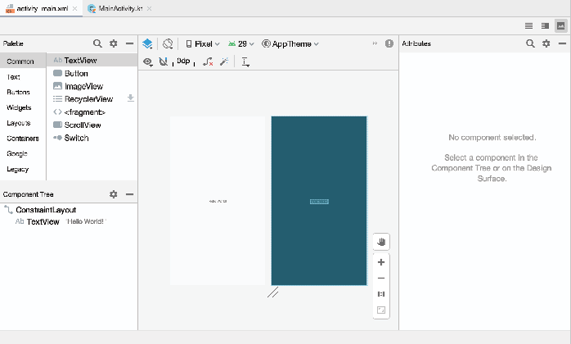
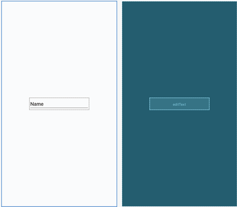
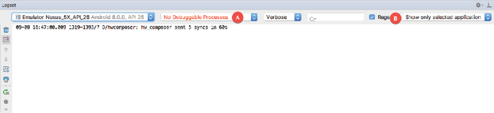
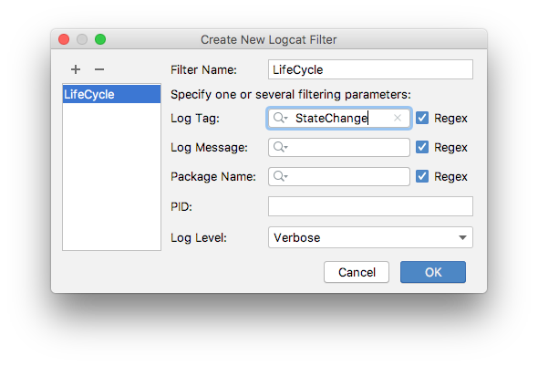
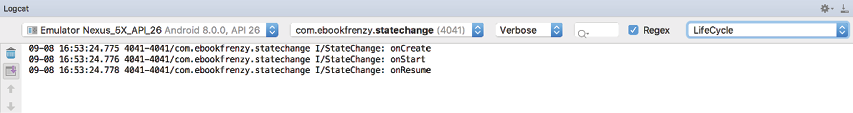

В предыдущих главах довольно подробно обсуждались различные состояния и жизненные циклы активностей, составляющих приложение Android. В этой главе мы применим теорию обработки изменений состояния активности на практике путем создания приложения. Цель этого тестового приложения - предоставить реальную демонстрацию, как активность проходит через множество различных состояний в среде выполнения Android. В следующей главе, этот проект будет расширен, чтобы продемонстрировать сохранение и восстановление динамического состояния в активности.

## Создание нового проекта
Первым шагом является создание нового проекта. 

Выберите шаблон *Empty Activity*. Далее, введите ```StateChange``` в поле *Name*. Прежде чем нажимать кнопку *Finish* проверьте настройку минимального уровня API и языка программирования (мы пишем на Java :) ).

Следующее действие, которое необходимо предпринять, включает разработку пользовательского интерфейса для активности. Он хранится в файле с именем activity_main.xml. Если он не открыт, перейдите к нему в окне *Project*, его можно найти в *app -> res -> layout*. После нахождения, двойной щелчок по файлу загрузит его в инструмент *Layout Editor*.



## Проектирование UI
Макет пользовательского интерфейса загружен в инструмент Layout Editor, пришло время разработать UI для нашего тестового приложения. 

Вместо *TextView* ```Hello world!``` поместим *EditText*. Выберите объект TextView на холсте редактора макета и нажмите клавишу Delete на клавиатуре, чтобы удалить его. На панели *Palette*, расположенной в левой части редактора макета, выберите категорию *Text* и из списка текстовых компонентов щелкните и перетащите компонент *Plain Text*. Переместите компонент в центр дисплея, чтобы появились центральные направляющие, и отпустите его так, чтобы компоновка напоминала схему на Рисунке 14-2.



При использовании виджета *EditText* необходимо указать *input type* (тип ввода). Это просто определяет тип текста или данных, которые будут введены пользователем. Например, если выбран тип *Phone*, пользователь будет ограничен вводом числовых цифр. Или, если тип ввода установлен на *TextCapCharacters*, по умолчанию будут вводиться символы верхнего регистра. Настройки типа входа также можно комбинировать. 

В нашем случае мы установим тип ввода для поддержки общего ввода текста. Для этого выберите виджет *EditText* в макете и найдите свойство *inputType* в окне инструмента *Attributes*. Щелкните значок флажка слева от текущего параметра, чтобы открыть список параметров и в нем отключите *textPersonName* и включите *text*, затем нажмите кнопку *Apply*. 

По умолчанию *EditText* отображает текст ```Name```. Оставаясь на панели *Attributes*, удалите это значение у свойства *text* свойств, чтобы представление было пустым в макете.

## Переопределение методов жизненного цикла деятельности
На данный момент проект содержит одну активность с именем *MainActivity*, потомок от Anroid-класса *AppCompatActivity*. Исходный код этой активности содержится в файле *MainActivity.java*, который уже должен быть открыт и представлен вкладкой на панели вкладок редактора. Если это не так, перейдите к нему на панели окна *Project* *app -> java -> <название вашего пакета> -> MainActivity* и дважды щелкните его, чтобы загрузить файл в редактор. После загрузки код должен выглядеть следующим образом:
```java
import androidx.appcompat.app.AppCompatActivity;
import android.os.Bundle;

public class MainActivity extends AppCompatActivity {

    @Override
    protected void onCreate(Bundle savedInstanceState) {
        super.onCreate(savedInstanceState);
        setContentView(R.layout.activity_main);
    }
}
```
Пока что единственным методом жизненного цикла, переопределенным активностью, является метод ```onCreate()```, в котором есть вызов метода экземпляра суперкласса и установка пользовательского интерфейса для активности. 

Мы изменим этот метод, чтобы он так же выводил диагностическое сообщение на панели *Logcat* при каждом запуске. Для этого мы будем использовать класс *Log*. Так же нам потребуется импортировать *android.util.Log* и объявить константу ```TAG```, которая позволит нам фильтровать сообщения в выводе журнала:

```java
import android.util.Log;

public class MainActivity extends AppCompatActivity {
    private static final String TAG = "StateChange";
    
    @Override
    protected void onCreate(Bundle savedInstanceState) {
        super.onCreate(savedInstanceState);
        setContentView(R.layout.activity_main);

        Log.i(TAG, "onCreate")
    }
}
```
Следующая задача - переопределить еще несколько методов, каждый из которых будет содержать соответствующий вызов ```Log.i()```. Эти переопределенные методы могут быть добавлены вручную или созданы с помощью сочетания клавиш ```Alt-Insert```.
```java
    @Override
    protected void onStart() {
        super.onStart();
        Log.i(TAG, "onStart");
    }

    @Override
    protected void onResume() {
        super.onResume();
        Log.i(TAG, "onResume");
    }
```
Тоже самое необзодимо проделать для методов:
*onPause*, *onStop*, *onRestart*, *onDestroy*, *onSaveInstanceState* и *onRestoreInstanceState*.

## Фильтрация в панели Logcat
Код добавленный к переопределенным методам предназначен для вывода логов в панели *Logcat*. Этот вывод может быть настроен для отображения всех событий, относящихся к сеансу устройства или эмулятора, или ограничен теми событиями, которые относятся к текущему выбранному приложению. Вывод также может быть ограничен только теми сообщениями, которые соответствуют указанному фильтру. 

Откройте окно *Logcat* и щелкните меню фильтра (обозначенное буквой **B** на рис. 14-3), чтобы просмотреть доступные параметры. Если для этого меню установлено значение *Show only selected application*, на панели Logcat будут отображаться только сообщения, относящиеся к приложению, выбранному в меню, отмеченном буквой **A**. С другой стороны, если выбрать вариант *No Filters*, будут отображаться все сообщения, созданные устройством или эмулятором.



Перед запуском приложения стоит продемонстрировать создание фильтра, который, при его выборе, будет дополнительно ограничивать вывод журнала, чтобы отображались только те сообщения журнала, содержащие тег, объявленный в нашей активности. В меню фильтра **(B)** выберите пункт меню *Edit Filter Configuration*. В диалоговом окне *Create New Logcat Filter* (рис. 14-4) назовите фильтр ```LifeCycle``` и в поле *Log Tag* введите значение константы *TAG*, объявленной в MainActivity.java, в нашем случае это ```StateChange```.



Когда изменения будут внесены, нажмите кнопку *OK*, чтобы создать фильтр и закрыть диалоговое окно. Cозданный фильтр теперь должен быть выбран в окне инструмента Logcat.

## Запуск приложения
Когда устройство настроено и подключено к компьютеру разработчика, нажмите кнопку запуска, представленную зеленым треугольником, расположенную на панели инструментов Android Studio или выберите пункт меню *Run -> Run* или используйте сочетание клавиш Shift + F10

После того, как Android Studio построит приложение и установит его на устройстве, оно должно запуститься и работать на переднем плане. Обзор панели Logcat должен показать, какие методы были запущены на данный момент (убедитесь, что выбран фильтр *LifeCycle*, созданный в предыдущем разделе, чтобы отфильтровать события журнала, которые в настоящее время нас не интересуют):



## Экспериментирование с активностью
Теперь, когда диагностика работает, пришло время протестировать приложение, чтобы получить представление об изменениях состояния жизненного цикла активности. Для начала рассмотрим исходную последовательность событий журнала на панели Logcat: 
```txt
onCreate 
onStart 
onResume
```
Очевидно, что изменения начального состояния в точности соответствуют описанию в предыдущей главе. Однако, обратите внимание, что вызов ```onRestoreInstanceState()``` не производился, поскольку среда выполнения Android обнаружила, что в текущей ситуации нет состояния для восстановления. 

Коснитесь значка *Home* в нижней строке на дисплее устройства и обратите внимание на последовательность вызовов методов, отображаемых в журнале: 
```txt
onPause 
onStop 
onSaveInstanceState
```
В этом случае среда выполнения заметила, что активность больше не находится на переднем плане, стала невидима для пользователя, и остановила её, но с предоставлением возможности сохранить динамическое состояние. В зависимости от того, уничтожила ли система активность в конечном итоге или просто перезапустила её, активность будет либо уведомлена о перезапуске с помощью вызова ```onRestart()```, либо снова пройдет последовательность создания, когда пользователь вернется к активности. 

Как рассказано в предыдущей главе, разрушение и воссоздание активности можно запустить, изменив конфигурацию устройства, например изменив ориентацию его экрана. Чтобы увидеть это в действии, просто поверните устройство, пока приложение *StateChange* находится на переднем плане. Результирующая последовательность вызовов методов в журнале логов должна выглядеть следующим образом:
```txt
onPause 
onStop 
onSaveInstanceState 
onDestroy 
onCreate 
onStart 
onRestoreInstanceState
onResume
```
Очевидно, что система дала активности возможность сохранить состояние перед уничтожением и перезапуском.

## Резюме
В этой главе мы создали Android-приложение с целью демонстрации различных состояний жизненного цикла, через которые может пройти активность. В ходе разработки проекта, мы также рассмотрели механизм генерации логов изнутри методов активности. В следующей главе мы расширим проект *StateChange*, чтобы продемонстрировать, как сохранять и восстанавливать динамическое состояние активности.
