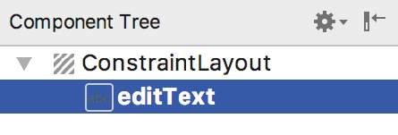

Если предыдущие несколько глав достигли своей цели, теперь должна быть понятна важность сохранения и восстановления состояния пользовательского интерфейса в определенные моменты жизненного цикла действия. 

В этой главе мы расширим приложение, созданного в предыдущей главе, чтобы продемонстрировать шаги, связанные с сохранением и восстановлением состояния, когда активность уничтожается и воссоздается. 

Ключевой компонент сохранения и восстановления динамического состояния включает использование класса *Bundle* из Android SDK.

## Сохранение динамического состояния
Активность, как мы уже узнали, дает возможность сохранять информацию о динамическом состоянии через реализацию метода *onSaveInstanceState()*, который вызывает система. В качестве аргумента методу передается ссылка на объект *Bundle*, в котором необходимо будет сохранить любые динамические данные. Затем объект *Bundle* сохраняется системой времени выполнения от имени активности и впоследствии передается в качестве аргумента методам *onCreate()* и *onRestoreInstanceState()* активности, когда они вызываются. В этих методах данные могут быть извлечены из объекта *Bundle* и использованы для восстановления состояния активности.

## Сохранение состояния UI по умолчанию
В предыдущей главе диагностический вывод приложения *StateChange* показал, что активность проходит через ряд изменений состояния, когда устройство, на котором она работает, поворачивается, вызвая изменение ориентации.

Запустите приложение *StateChange* еще раз, только на этот раз введите текст в поле *EditText* перед поворотом устройства. После поворота в окне *Logcat* должна появиться следующая последовательность:
```txt
onPause 
onStop 
onSaveInstanceState 
onDestroy 
onCreate 
onStart 
onRestoreInstanceState 
onResume
```
Очевидно, это привело к уничтожению и воссозданию активности. Однако текст, введенный в поле *EditText*, был сохранен. Как же это так? Ведь мы не писали какой-либо код, для сохранения и восстановления текста.

Фактически, большинство виджетов, включенных в Android SDK, уже реализуют поведение, необходимое для автоматического сохранения и восстановления состояния при перезапуске активности. Единственное требование для сохранения этого поведения - это чтобы переопределенные методы ```onSaveInstanceState()``` и ```onRestoreInstanceState()``` в активности включали вызовы эквивалентных методов суперкласса:
```java
@Override 
protected void onSaveInstanceState(Bundle outState) {
    super.onSaveInstanceState(outState); 
} 

@Override 
protected void onRestoreInstanceState(Bundle savedInstanceState) {
    super.onRestoreInstanceState(saveInstanceState); 
}
```
Автоматическое сохранение состояния для виджета пользовательского интерфейса можно отключить, установив свойству *saveEnabled* значение ```false```. В целях изучения, мы отключим механизм автоматического сохранения состояния для *EditText*, а затем добавим код, для ручного сохранения и восстановления состояния. (Обратите внимание, что XML можно редактировать напрямую, щелкнув вкладку *Text* в нижней части панели *Layout Editor*. Полное название этого свойства *android:saveEnabled*)

Измените свойство *saveEnabled* у *EditText* на ```false```. После, запустите приложение, введите текст и поверните устройство, чтобы убедиться, что текст больше не сохраняется и не восстанавливается.

## Класс Bundle
Для ситуаций, когда необходимо сохранить состояние за пределами функциональности по умолчанию, предоставляемой виджетами пользовательского интерфейса, класс *Bundle* предоставляет контейнер для хранения данных с использованием механизма *key-value*. Ключи принимают форму строковых значений, тогда как значения, связанные с этими ключами, могут быть в форме примитивного значения или любого объекта, реализующего интерфейс *Parcelable* из Android SDK. Широкий спектр классов уже реализует интерфейс Parcelable. Пользовательские классы можно сделать *parcelable* путем реализации набора методов, определенных в интерфейсе *Parcelable*, подробную информацию о которых можно найти в документации Android по адресу: [https://developer.android.com/reference/android/os/Parcelable.html](https://developer.android.com/reference/android/os/Parcelable.html)

Класс *Bundle* также содержит набор методов, которые можно использовать для получения и установки пар *key-value* для различных типов данных, включая как примитивные типы (*boolean*, *char*, *double* и *float*), так и объекты (такие как *Strings* и *CharSequence*). 

Отключив автоматическое сохранение текста для *EditText*, нам необходимо убедиться, что текст, введенный пользователем в поле *EditText*, сохраняется в объекте Bundle и впоследствии восстанавливается. Это будет служить демонстрацией того, как вручную сохранять и восстанавливать состояние в приложении Android, и будет достигнуто с помощью методов *putCharSequence()* и *getCharSequence()* класса *Bundle*.

## Сохранение состояния
Первым шагом надо сделать так, чтобы текст, введенный пользователем, был извлечен из компонента *EditText* в методе *onSaveInstanceState()* активности *MainActivity*, а затем сохранен в объекте *Bundle*.

Чтобы извлечь текст из объекта *EditText*, нам сначала нужно идентифицировать этот объект в пользовательском интерфейсе. Очевидно, это включает в себя устранение разрыва между Java-кодом активности (содержащимся в файле MainActivity.java) И XML-представлением пользовательского интерфейса (содержащимся в файле ресурсов activity_main.xml). Чтобы извлечь текст, введенный в компонент *EditText*, нам необходимо получить доступ к этому объекту пользовательского интерфейса.

Каждый компонент в пользовательском интерфейсе связан с уникальным идентификатором. По умолчанию инструмент *Layout Editor* создает идентификатор для вновь добавленного компонента из типа объекта. Если в макете содержится несколько представлений одного и того же типа, за именем типа следует порядковый номер (хотя разработчик может и должен изменить его на что-то более значимое). Проверив панель *Component Tree*, можно увидеть, компоненту *EditText* назначен идентификатор ```editText```



