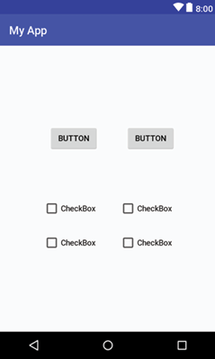
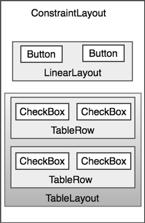
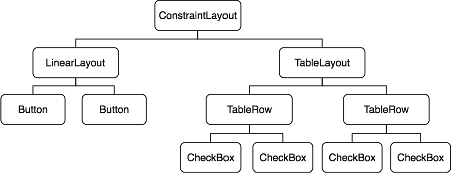

Возможно, за исключением прослушивания потокового звука, взаимодействие пользователя с устройством Android в основном визуально и тактильно. Все это взаимодействие происходит через пользовательские интерфейсы приложений, как встроенные, так и любые сторонние, установленные пользователем. Поэтому неудивительно, что ключевым элементом разработки приложений для Android является проектирование и создание пользовательских интерфейсов. 

В этой главе будет рассмотрена тема структуры пользовательского интерфейса Android, а также дан обзор различных элементов, которые могут быть объединены для его создания; а именно View, View Groups и Layouts.

## Проектирование для различных устройств Android
Термин *Android-устройство* охватывает широкий спектр продуктов, планшетов и смартфонов с экранами разных размеров и разрешений. В результате пользовательские интерфейсы приложений должны быть тщательно спроектированы, чтобы обеспечить правильное представление на максимально широком диапазоне размеров дисплеев. Ключевой частью этого является правильное изменение размеров макета пользовательского интерфейса при запуске на разных устройствах. Этого можно в значительной степени достичь путем тщательного планирования и использования layout-менеджеров, описанных в этой главе. 

Также важно помнить, что большинство смартфонов и планшетов на базе Android можно держать в руках как в портретной, так и в альбомной ориентации. Хорошо разработанный пользовательский интерфейс должен уметь адаптироваться к таким измененим и вносить разумные корректировки макета, чтобы использовать доступное пространство экрана в каждой ориентации.

## View и View Groups
Каждый элемент пользовательского интерфейса является подклассом класса Android *View* (а точнее *android.view.View*). Android SDK предоставляет набор классов представлений, которые можно использовать для создания пользовательского интерфейса. Типичные примеры включают стандартные элементы, такие как классы *Button*, *CheckBox*, *ProgressBar* и *TextView*. Такие представления также называются виджетами или компонентами. Для требований, которые не выполняются виджетами, поставляемыми с SDK, новые виджеты могут быть созданы либо путем создания подклассов и расширения существующего класса, либо путем создания полностью нового компонента, наследуюясь уже от класса *View*. 

Компонент может также состоять из нескольких других компонентов (*composite view*). Такие компоненты являются потомками класса Android *ViewGroup* (*android.view.ViewGroup*), который сам является подклассом *View*. Примером такого компонента является *RadioGroup*, который предназначен для содержания нескольких объектов *RadioButton*, так, что только один из них может находиться в положении "on" (включено). С точки зрения структуры, составные компоненты состоят из единственного родительского компонента (производного от класса *ViewGroup*, его еще называют контейнер или корневой элемент), который может содержать другие компоненты (дочерние). 

Другой категорией компонентов-контейнеров на основе *ViewGroup* является layout-менеджер.

## Layout Managers
В дополнение к компонентам, описанным в предыдущем разделе, SDK также включает набор, называемых *Layout* (раскладка | компоновка). Layout-ы представляют собой контейнерные компоненты (и, следовательно, являются производными от *ViewGroup*), разработанные с единственной целью - контролировать расположение дочерних компонентов на экране. Android SDK включает следующие layout-ы, которые можно использовать в дизайне пользовательского интерфейса Android:
- **ConstraintLayout** - представленный в Android 7, использование этого layout-менеджера рекомендуется для большинства задач раскладки компонентов. *ConstraintLayout* позволяет определять положение и поведение компонентов с помощью простых настроек *constraint* (ограничений | привязок), назначаемых каждому дочернему элементу. Гибкость этого layout позволяет быстро и легко создавать сложные макеты без необходимости вкладывать разные типы layout-ов друг в друга, что приводит к повышению производительности. *ConstraintLayout* также тесно интегрирован в инструмент *Layout Editor*. Если не указано иное, это предпочтительный вариант для большинства примеров в этой книге. 
- **LinearLayout** - размещает дочерние элементы в одну линию по горизонтали или вертикали, в зависимости от выбранного значения свойства *orientation*. Для каждого дочернего элемента можно установить значение *weight*, чтобы указать, какую часть пространства этот дочерний элемент должен занимать по сравнению с другими дочерними элементами. 
- **TableLayout** - упорядочивает дочерние элементы в виде сетки из строк и столбцов. Каждая строка в таблице представлена дочерним объектом *TableRow*, который, в свою очередь, содержит элемент для каждой ячейки. 
- **FrameLayout** - назначение *FrameLayout* - выделить область экрана, как правило, для отображения одного компонента. Если добавлено несколько дочерних элементов, они по умолчанию будут отображаться друг над другом в верхнем левом углу области layout-a. Альтернативное расположение отдельных дочерних элементов может быть достигнуто с помощьюустановка значений свойства *gravity* для каждого ребенка. Например, установка значения *gravity* в ```center_vertical```, для дочернего элемента приведет к тому, что он будет расположен в центре по вертикали у содержащего его *FrameLayout*.
- **RelativeLayout** - позволяет расположить дочерние элементы относительно друг друга и содержащего  их layout-a посредством спецификации выравнивания и отступов на дочерних элементах. Например, дочерний элемент A может быть настроен для размещения в вертикальном и горизонтальном центре содержащего его *RelativeLayout*. А элемент B также может быть сконфигурирован, чтобы центрироваться по горизонтали внутри *RelativeLayout*, но располагаться на 30 пикселей выше верхнего края элемента A, тем самым делая вертикальное положение относительно положения вида A. *RelativeLayout* может быть особенно полезен при разработке пользовательского интерфейса, который должен работать с экранами различных размеров и ориентаций. 
- **AbsoluteLayout** - позволяет расположить дочерние представления в определенных координатах X и Y внутри layout-a. Использование этого макета не рекомендуется, так как ему не хватает гибкости для реагирования на изменения размера и ориентации экрана. 
- **GridLayout** - экземпляр *GridLayout* разделен невидимыми линиями, которые образуют сетку, содержащую строки и столбцы ячеек. Затем дочерние элементы помещаются в ячейки и могут быть настроены для покрытия нескольких ячеек как по горизонтали, так и по вертикали, что позволяет быстро и легко реализовать широкий спектр параметров макета. Промежутки между компонентами в *GridLayout* могут быть реализованы путем размещения специального компонента *Space* в соседние ячейки или путем установки параметров отступов.
- **CoordinatorLayout** - представленный как часть библиотеки *Android Design Support Library* с Android 5.0, *CoordinatorLayout* разработан специально для координации отображения и поведения панели приложения в верхней части экрана с другими элементами макета. При создании новой активности с использованием шаблона *Basic Activity* родительский layout в *main_layout* будет реализован с использованием экземпляра *CoordinatorLayout*. Этот layout-менеджер мы еще расмотрим подробнее.

При использования layout-ов в пользовательском интерфейсе для приложений Android стоит помнить, что они могут быть вложены друг в друга для создания дизайна пользовательского интерфейса практически любой сложности.

## Иерархия компонентов
Каждый компонент в пользовательском интерфейсе представляет собой прямоугольную область дисплея. Компонент отвечает за то, что нарисовано в этом прямоугольнике, и за реакцию на события, происходящие в этой части экрана (например, событие касания). 

Экран пользовательского интерфейса состоит из иерархии компонентов с корневым элементом, расположенным в верхней части дерева, и дочерними компонентоми, расположенными на ветвях ниже. Дочерний элемент контейнера появляется поверх своего родительского и должен отображаться в границах области родительского компонента. Рассмотрим, например, пользовательский интерфейс, показанный на рисунке 16-1:



В дополнение к видимым кнопкам и флажкам (checkbox-ы), пользовательский интерфейс включает в себя ряд layout-компонентов, которые управляют расположением видимых компонентов. На рис. 16-2 показан альтернативный вид пользовательского интерфейса, на этот раз подчеркнув наличие layout-компонентов по отношению к дочерним:



Как обсуждалось ранее, пользовательские интерфейсы построены в форме иерархии компонентов с корневым элементом наверху. В этом случае мы также можем визуализировать приведенный выше пример пользовательского интерфейса в виде дерева компонентов, показанного на рисунке 16-3:



Когда пользовательский интерфейс отображается для пользователя, среда выполнения Android просматривает иерархию компонентов, начиная с корневого и работая вниз по дереву отрисовывает каждый компонент.

## Создание пользовательских интерфейсов
С более четким пониманием концепций виджетов, layout-менеджеров и иерархии компонентов, мы пройдем через следующие несколько глав, которые будут посвящены этапам создания пользовательских интерфейсов для Android-активностей. Фактически, существует три различных подхода в разработке пользовательского интерфейса: использование инструмента *Layout Editor*, ручное написание XML-файлов ресурсов макета или написание кода на Java. Каждый из них будет рассмотрен.

## Резюме
Каждый элемент на экране приложения Android представляет собой компонент, который в конечном итоге является подклассом класса *android.view.View*. Каждый компонент представляет собой прямоугольную область дисплея устройства и отвечает за то, что отображается в этом прямоугольнике, и как обрабатывать события, которые происходят в границах компонента. Несколько компонентов могут быть объединены для создания одного составного компонента. Элементы в составном компоненте являются дочерними элементами компонента-контейнера, который обычно является подклассом *android.view.ViewGroup* (а сам является подклассом *android.view.View*). Пользовательский интерфейс состоит из элементов, построенных в форме иерархии компонентов. 

Android SDK включает ряд компонентов, которые можно использовать для создания интерфейса. К ним относятся основные виджеты, такие как текстовые поля и кнопки, а еще ряд layout-менеджеров, которые можно использовать для управления расположения дочерних элементов. В случае, если компоненты из Android SDK не подходят нашим требованиям, мы можем создать свой компонент, либо путем расширения (наследования) от существующего компонента, либо путем создания совершенно нового компонента отнаследовавшись от *android.view.View*. 

Пользовательские интерфейсы могут быть созданы с помощью инструмента *Layout Editor*, написания вручную XML-файла макета или написанием Java-кода. Каждый из этих подходов будет рассмотрен в следующих главах.
