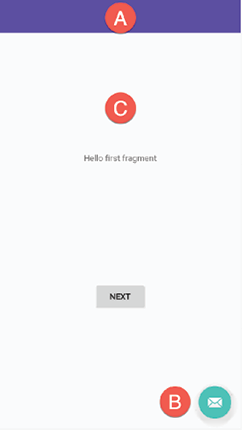
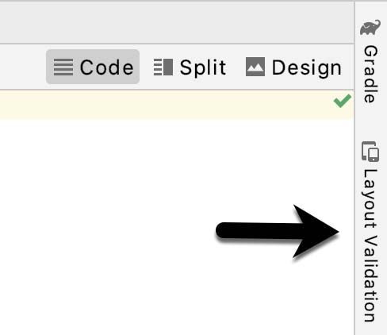

Сложно придумать концепцию Android-приложения, которое не требует пользовательского интерфейса. Большинство устройств Android оснащены сенсорным экраном и клавиатурой (виртуальной или физической), а касания и смахивания являются основной формой взаимодействия между пользователем и приложением. Эти взаимодействия происходят через пользовательский интерфейс приложения. Хорошо спроектированный и реализованный пользовательский интерфейс, важный фактор в создании успешного и популярного приложения для Android. Он может варьироваться от простого до чрезвычайно сложного в зависимости от требований к дизайну отдельного приложения. Независимо от уровня сложности, инструмент *Layout Editor* значительно упрощает задачу проектирования и реализации пользовательских интерфейсов в Android.

## Шаблоны активностей Basic и Empty
Как мы уже знаем, приложения Android состоят из одной или нескольких активностей. Активность - это автономный модуль функциональности приложения, который обычно напрямую связан с одним экраном пользовательского интерфейса. Таким образом, при работе с *Layout Editor* мы неизменно работаем над макетом активности. 

При создании нового проекта в Android Studio доступен ряд различных шаблонов, которые можно использовать в качестве отправной точки для пользовательского интерфейса основной активности. Самыми частыми из этих шаблонов являются шаблоны *Basic Activity* и *Empty Activity*. Хотя на первый взгляд они кажутся похожими, на самом деле между ними есть существенные различия в двух местах. Чтобы увидеть эти различия в *Layout Editor*, используйте меню *View Options*, чтобы включить *Show System UI*, как показано на рисунке 17-1 ниже:

Шаблон *Empty Activity* создает один файл макета, состоящий из *ConstraintLayout*, содержащего объект *TextView*, как показано на рисунке 17-2:

*Basic Activity* состоит из нескольких файлов макетов. Файл макета верхнего уровня имеет *CoordinatorLayout* в качестве корневого элемента, настраиваемую панель приложения (также известную как action bar), которая появляется в верхней части экрана устройства (отмечена **A** на рис. 17-3), и кнопку *floating action* (помечена **B**). В дополнение к этим этому, файл макета activity_main.xml содержит ссылку на второй файл с именем content_main.xml, содержащий макет контента (помеченный **C**):

*Basic Activity* содержит макеты для двух экранов, оба из которых содержат *Button* и *TextView*. Цель этого шаблона - продемонстрировать, как реализовать навигацию между несколькими экранами в приложении. Если запустить немодифицированное приложение, использующее шаблон *Basic Activity*, появится первый из этих двух экранов (помечен **A** на рисунке 17-4). Нажатие кнопки Next приведет к переходу ко второму экрану (**B**), который, в свою очередь, содержит кнопку для возврата к первому экрану:

Для такого поведения используются две возможности Android: *fragments* (фрагментами) и *navigation* (навигация), обе будут рассмотрены далее в книге. Ощутимо далее. 

Файл content_main.xml содержит специальный фрагмент, известный как *Navigation Host Fragment*, который позволяет включать и выключать различное содержимое в зависимости от настроек, заданных в файле *res -> layout -> nav_graph.xml*. В случае шаблона *Basic Activity* файл nav_graph.xml настроен для переключения между макетами пользовательского интерфейса, определенными в файлах fragment_first.xml и fragment_second.xml, в зависимости от нажатия пользователем кнопок Next и Previous. 

Очевидно, что шаблон *Empty Activity* полезен, если вам не нужны, ни кнопка *floating action*, ни меню в вашей активности, и не требуется особого поведения панели приложения, обеспечиваемого *CoordinatorLayout*. Например, параметры, позволяющие убрать панель приложения и панель инструментов во время определенной прокрутки. Однако шаблон *Basic Activity* полезен тем, что предоставляет эти элементы по умолчанию. Часто бывает быстрее создать новую активность, используя шаблон *Basic Activity* и удалить элементы, которые вам не требуются, чем использовать шаблон *Empty Activity* и вручную реализовывать необходимый функционал.

## Layout Editor
Как было продемонстрировано в предыдущих главах, инструмент *Layout Editor* предоставляет среду «what you see is what you get» (WYSIWYG), в которой компоненты можно выбирать из панели *Palette*, а затем помещать на холст, представляющий дисплей устройства Android. После того, как представление было размещено на холсте, его можно перемещать, удалять и изменять размер (в соответствии с ограничениями родительского компонента). Кроме того, широкий спектр свойств, относящихся к выбранному компоненту, может быть изменен с помощью окна *Attributes*. 

Под капотом инструмент *Layout Editor* фактически редактирует XML-файл ресурсов, содержащий xml-представление разрабатываемого пользовательского интерфейса. Поэтому, инструмент *Layout Editor* может работать в трех различных режимах: *Design*, *Code* и *Split*.

## Режим Design
В режиме *Design* пользовательским интерфейсом можно визуально манипулировать, напрямую работая с палитрой виджетов и графическим представлением layout. На рис. 17-5 выделены ключевые области инструмента *Layout Editor* в режиме *Design*:

- **A - Palette** - эта панель обеспечивает доступ к ряду компонентов, предоставляемых Android SDK. Они сгруппированы по категориям для удобства навигации. Элементы можно добавлять в макет, перетаскивая компонент из палитры в желаемое место на макете. 
- **B - Device Screen** - обеспечивает визуальное представление макета пользовательского интерфейса в том виде, в каком он разрабатывается, «what you see is what you get». Этот макет позволяет напрямую управлять дизайном, позволяя выбирать, удалять, перемещать и изменять размеры элементов. Модель устройства, представленная макетом, может быть изменена в любой момент с помощью меню, расположенного на панели инструментов. 
- **С - Component Tree** - как описано в предыдущей главе, пользовательские интерфейсы строятся с использованием иерархической структуры. *Component Tree* обеспечивает визуальный вид иерархии пользовательского интерфейса. При выборе элемента из дерева компонентов будет выбран соответствующий элемент в макете. Точно так же при выборе элемента на макете, этот элемент будет выбран в иерархии *Component Tree*. 
- **D - Attributes** - Все компоненты, перечисленные в панели *Palette*, имеют связанный с ними набор атрибутов, которые можно использовать для настройки поведения и внешнего вида этого компонента.
- **E - Toolbar** - панель инструментов, обеспечивает быстрый доступ к широкому спектру опций, включая, возможность увеличивать и уменьшать масштаб экрана устройства, изменять отображаемую в данный момент модель устройства, вращать макет между книжной и альбомной ориентацией. и переключаться на другой уровень API Android SDK. На панели инструментов также есть набор контекстно-зависимых кнопок, которые появляются, в зависимости от выбранного компонента в макете. 
- **F - Mode Switching Controls** - эти три кнопки позволяют переключаться между режимами *Design*, *Code* и *Split* 
- **G - Zoom and Pan Controls** - эта панель управления позволяет увеличивать и уменьшать масштаб холста и перетаскивать его, при необходимости.

## Palette
Окно *Palette* состоит из двух панелей, предназначенных для упрощения поиска и предварительного просмотра компонентов при добавлении в макет. На панели категорий (обозначенной буквой **A** на рис. 17-6) перечислены различные категории компонентов, поддерживаемых Android SDK. Когда категория выбирается из списка, вторая панель (**B**) обновляется, отображая список компонентов, которые попадают в эту категорию:

Чтобы добавить компонент из палитры на холст макета, просто выберите элемент в списке компонентов и перетащите его в нужное место на холсте. 

Поиск определенного компонента может быть инициирован нажатием кнопки поиска (отмеченной буквой **C**). По мере ввода символов результаты соответствия будут отображаться на панели списка компонентов.

## Отображение макета в режиме Design
Когда инструмент *Layout Editor* находится в режиме *Design*, макет можно просматривать двумя разными способами. Представление, показанное на рис. 17-5, является представлением *Design* и показывает макет и виджеты в том виде, в каком они будут отображаться в работающем приложении. Второй режим, называемый *Blueprint*, может отображаться либо вместо представления *Design*, либо одновременно с ним. Меню панели инструментов, показанное на рисунке 17-8, предоставляет опции для отображения Design, Blueprint или обоих представлений. Четвертый вариант, *Force Refresh Layout*, заставляет компоновку перестраиваться и перерисовываться. Это может быть полезно, когда макет переходит в неожиданное состояние или неточно отражает текущие настройки дизайна:

Какие режимы отображать - дело личных предпочтений. Хороший подход - начать с отображения обоих, как показано на рисунке 17-9:

## Режим Code
При использовании инструмента *Layout Editor* важно помнить, что все, что он на самом деле делает, это обеспечивает удобный подход к созданию XML-файлов ресурсов макета. В любой момент в процессе проектирования базовый XML можно просмотреть и напрямую отредактировать, просто нажав кнопку *Code*, расположенную в верхнем правом углу панели инструментов, как показано на рисунке 17-10:

На рис. 17-11 показан инструмент *Layout Editor* в режиме *Code*, позволяющий вносить изменения в пользовательский интерфейс, путем прямого изменения XML-файла:

## Режим Split
В режиме *Split* редактор отображает представления *Design* и *Code*, позволяя изменять пользовательский интерфейс как визуально с использованием холста, так и путем внесения изменений непосредственно в XML-файл. Чтобы войти в режим разделения, нажмите среднюю кнопку, показанную на рисунке 17-12 ниже:

Любые изменения в XML автоматически отражаются на холсте и наоборот. На рисунке 17-13 показан редактор в режиме *Split*:

## Attributes
Панель *Attributes* предоставляет доступ ко всем настройкам для выбранного компонента. На рис. 17-14, например, показаны атрибуты виджета *TextView*:

Окно *Attributes* разделено на следующие разделы. 
- **id** - содержит свойство *id*, которое определяет имя, по которому выбранный элемент будет доступен в исходном коде приложения. 
- **Declared Attributes** (объявленные атрибуты) - содержат все свойства, которым уже присвоено значение. 
- **Layout** - параметры, определяющие, как выбранный компонент располагается, его размер по отношению к экрану и другим объектам в макете. 
- **Common Attributes** (общие атрибуты) - список атрибутов, которые обычно необходимо изменить для выбранного компонента. 
- **All Attributes** - полный список всех атрибутов, доступных для выбранного компонента. Поиск определенного атрибута может быть выполнен путем поиска на панели окна *Attributes* и ввода имени атрибута. 

Некоторые атрибуты содержат узкую кнопку справа в поле значения. Это означает, что диалоговое окно *Resources* доступно для помощи в выборе подходящего значения. Чтобы открыть диалоговое окно, просто нажмите кнопку. Внешний вид этой кнопки изменяется в зависимости от того, хранится ли соответствующее значение в файле ресурсов или захардкожено. Если значение хранится в файле ресурсов, кнопка справа от поля будет заполнена, чтобы указать, что значение не захардкожено, как показано на рисунке 17-15 ниже:

Атрибуты, для которых доступно ограниченное количество опций, представят раскрывающееся меню (рисунок 17-16), из которого можно сделать выбор.

Значок пипетки (как показано в поле backgroundTint на рис. 17-15) можно щелкнуть для отображения палитры выбора цвета. Точно так же, когда на этом месте появляется значок флага, его можно щелкнуть, чтобы отобразить список параметров, доступных для атрибута. Значок изображения открывает панель диспетчера ресурсов, позволяющую выбирать изображения и другие типы ресурсов для атрибута.

## Преобразование вьюх
Изменение компонента в макете с одного типа на другой (например, преобразование *TextView* в *EditText*) можно легко выполнить в *Layout Editor*, просто щелкнув правой кнопкой мыши на компоненте на холстке или в окне *Component Tree* и выбрав пункт меню *Convert view...* (Рисунок 17-17):

Появится диалоговое окно со списком совместимых типов компонентов, в которые выбранный объект может быть преобразован. Например, на рис. 17-18, показаны типы, в которые можно преобразовать существующее представление *TextView*:

Этот подход также полезен для преобразования layout-ов, из одного типа в другой (например, *ConstraintLayout* в *LinearLayout*).

## Отображение образцов данных
При разработке макетов в Android Studio будут возникать ситуации, когда контент, отображаемый в пользовательском интерфейсе, будет недоступен, пока приложение не будет запущено. Иногда это может затруднить оценку того, как макет будет отображаться во время выполнения приложения. Чтобы решить эту проблему, редактор макета позволяет указывать образцы данных, которые могут быть использованы для заполнения. Эти образцы данных отображается только в редакторе макета и не отображается при запуске приложения. Образцы данных можно настроить либо путем прямого редактирования XML-файла макета, либо визуально с помощью помощника *Design-time*, который можно вызвать щелкнув правой кнопкой мыши по виджету и выбрав в меню пункт *Set Sample Data*. Панель *Design-time* будет отображать ряд предварительно сконфигурированных параметров для демонстрационных данных, которые будут отображаться в выбранном элементе, включая комбинации текста и изображений в различных конфигурациях. Например, на рис. 17-19 показаны параметры образцов данных, отображаемые для списка *RecyclerView*:

Пользовательский текст и изображения могут быть предоставлены для отображения в процессе разработки макета. Более плотно с образцами данных мы познакомимся далее в книге.

## Создание пользовательских устройств
Меню *Device for Preview* на панели инструментов *Layout Editor* (рис. 17-20) предоставляет список предварительно сконфигурированных типов устройств, которые при выборе отображаются в виде холста экрана устройства. Помимо предварительно настроенных типов устройств, любые экземпляры AVD, которые были настроены в среде Android Studio, также будут перечислены в меню. Чтобы добавить дополнительную конфигурацию устройства, откройте меню, выберите пункт *Add Device Definition...* и выполните действия по созданию виртуального устройства.

## Смена текущего устройства
В качестве альтернативы, текущее устройство может быть изменено, с помощью "ручки" изменения размера, расположенной рядом с нижним правым углом экрана устройства (Рисунок 17-21). По мере изменения размера экрана будут появляться маркеры, указывающие на различные варианты размера и ориентации, доступные для выбора:

## Layout Validation (Мультипросмотр)
Панель *Layout Validation* позволяет предварительно просмотреть макет пользовательского интерфейса на нескольких размерах экрана одновременно. Чтобы получить доступ к мультипросмотру, нажмите вкладку, расположенную в правом верхнем углу главного окна Android Studio, как показано на рисунке 17-22:

После загрузки, панель будет выглядеть, как показано на рис. 17-23, с макетом, отображаемым на нескольких конфигурациях экрана устройств Pixel:

## Резюме
Ключевой частью разработки приложений для Android является создание пользовательского интерфейса. В среде Android Studio это выполняется с помощью инструмента *Layout Editor*, который работает в трех режимах. В режиме *Design* компоненты выбираются из панели *Palette* и размещаются на макете, представляющем экран устройства Android, а настраиваются с использованием панели списка атрибутов. В режиме *Code* можно напрямую редактировать XML-файл, представляющий макет пользовательского интерфейса. Режим *Split* позволяет создавать и изменять макет, объединив эти два режима. Сочетание этих режимов обеспечивает обширную и интуитивно понятную среду разработки пользовательского интерфейса. 

Панель *Layout Validation* позволяет быстро просмотреть макеты пользовательского интерфейса на различных экранах устройств.
